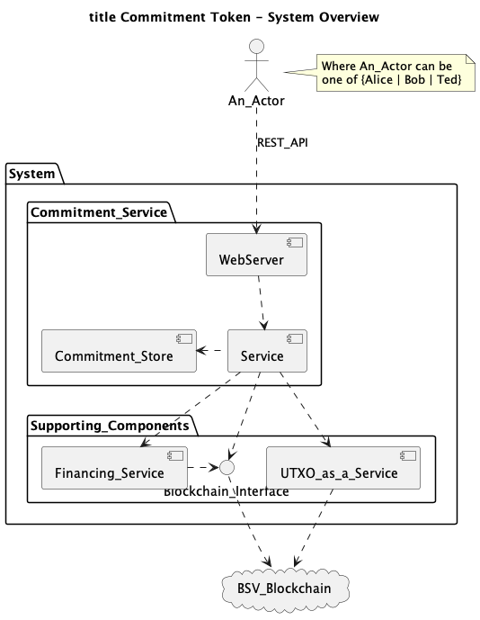

# Universal Blockchain Assets (UBA)

This project captures the demonstration of "Universal Blockchain Asset: What if your blockchain is different to mine?", presented at the London Blockchain Conference on 21-23 May 2024.

## Reference
The reference used for this work is

1.  Universal Blockchain Assets - Owen Vaughan - [Universal Blockchain Assets.pdf](https://eprint.iacr.org/2024/784.pdf)

# Configuration

Please refer to the [Getting Started](#docs/Getting_started) page for configuration prerequisites, i.e. key/account creation.


# Getting Started

At the top level, run:

```Bash
docker compose up
```

For more information about getting the project started see [here](#docs/Getting_started).

# Resetting the data

To restart cleanly, please delete the following files in the `data` directory:
- commitments.json
- token_store.json


# System Components



# Overview of Operation


# Development Information

For information about developing the project see [here](#docs/Development).