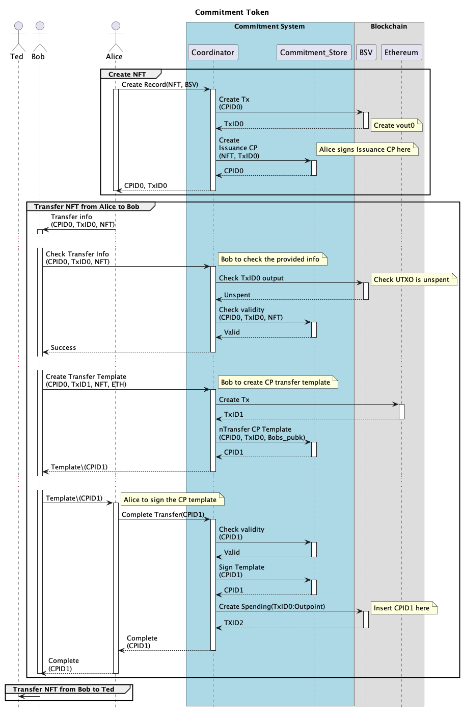
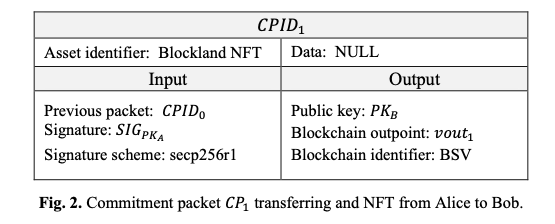

# Development information


## Directories
This project consists of the following directories:
```
.
├── data
├── docs
│   └── diagrams
├── python
│   └── src
│       ├── ethereum
│       ├── service
│       ├── tests
│       └── web3_py
└── streamlit_ui
```

These directories contain the following:
* `data` - Configuration and data used by this project, this is where the data is stored
* `docs` - Project documentation and UML diagrams
* `python` - The source for backend server 
* `streamlit_ui` - The source for the UI 


## Working without Blockchain
This project has a `feature flag` in the configuration file which disables the creation of transactions and blockchain access.

It is recommended that the `blockchain_enabled` flag is set to `false` for test purposes.

``` toml
[commitment_service]
blockchain_enabled = false
```

# Python Development
To lint the source code use the following command line script from the project root directory:
```
$ ./lint.sh
```
This requires `flake8` and `mypy` to be installed to perform the static code analysis.

## Python dependencies
The project python dependencies can be found in `requirements.txt` in the project root.

## Developing in Docker
Note that you can run the Python code and edit it using
``` bash
$ ./run.sh bash
# python3 main.py
```
which will provide you with a prompt, from which you can run the code with all the dependencies installed.
Note that the directories `src` and `data` are mounted on the docker image at runtime (as `/app/python` and `\app\data` respectively). 
So updates made outside the docker image are reflected immediately inside the image. So you can edit files with your standard IDE.

## Unit tests in Docker
To run the unit tests in the Docker container, build the image, ensure Docker is running, then run the test script:
```bash
$ ./build.sh
$ ./tests.sh
```


## Main Sequence of Operation



## Commitment Packet Format


